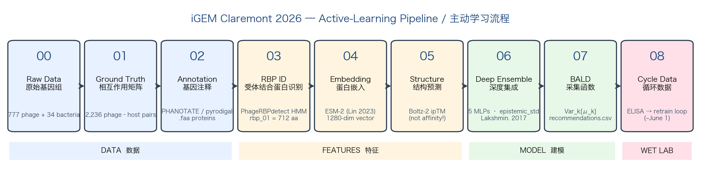
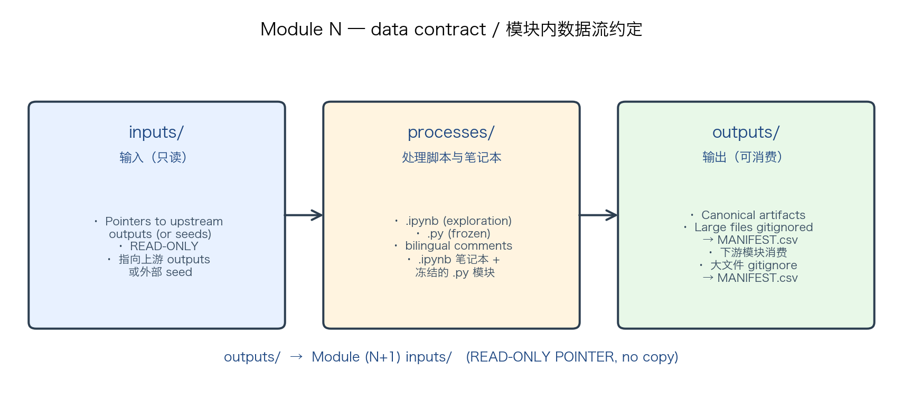
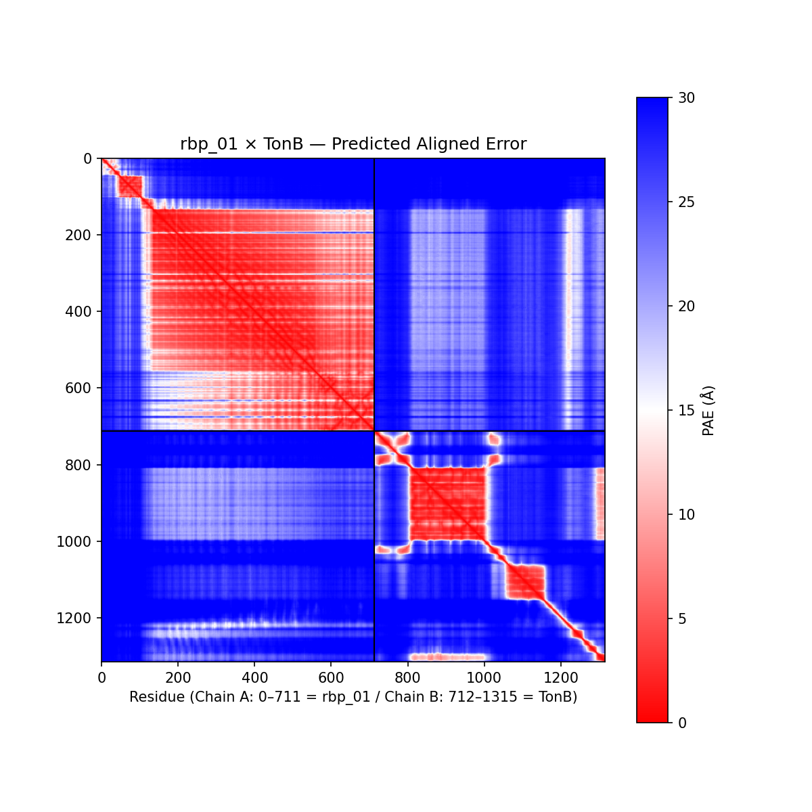
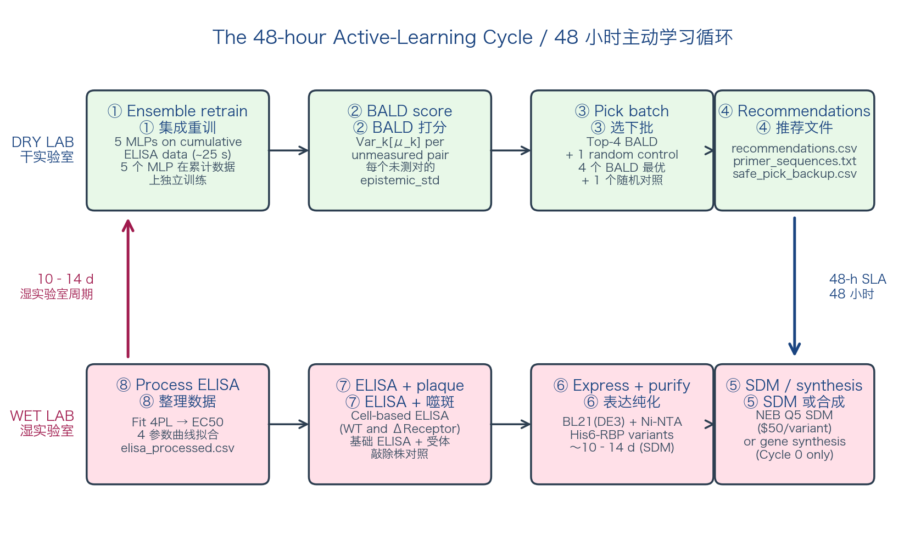

# 入职指南 —— iGEM Claremont 2026

**针对黄单胞菌生物防治的噬菌体主动学习工程**
 
> 配套 `slides_zh.pdf`。如果错过了演示，或要找到某张 slide 背后的具体文件路径、命令、引用，请读本文。

| | |
|---|---|
| **核心工程师** | Alex Chen |
| **湿实验室负责人** | Sarah、Olivia、Weitao、Carol |
| **贡献者** | Ryan、Leah |
| **PI** | Prof. J. Cesar Ignacio-Espinoza |
| **学术顾问** | Prof. Ran Libeskind-Hadas |
| **分支** | `active-learning-pipeline`（main 是空的 —— 不要在 main 上工作） |
| **当前状态** | Module 00–07 已全部完成并通过测试。Module 08 从首次 ELISA 交付（约 6 月 1 日）开始。 |

---

## 1. 项目一览

> [!info] 本节关键术语 / Key vocabulary for this section
> - **噬菌体（phage / bacteriophage）** —— 一种感染细菌的病毒。我们用的是*裂解性*噬菌体 —— 复制后让宿主细胞破裂死亡。（对照：*溶原性*噬菌体把自己整合进基因组、保持休眠。）
> - **RBP（受体结合蛋白）** —— 噬菌体尾部上一个特定的蛋白，负责与细菌表面的某个特定受体结合。这是决定"这只噬菌体能不能附着上这种宿主"的"钥匙-锁"步骤。
> - **主动学习（active learning）** —— 一种机器学习训练方式：每轮训练之后，*由模型*来挑选下一个该做的实验，而不是人随便挑。我们用它，是因为每次 ELISA 测量都很贵 —— 要让每次测量都尽可能有信息量。
> - **闭环（closed-loop）** —— 模型推荐 → 湿实验室测 → 结果回流 → 模型重训。环路自己合上。
> - **ELISA** —— 酶联免疫吸附测定。一个标准的 96 孔板实验，输出一条结合曲线。这是模型预测的数值目标。
> - **BALD** —— 我们用的算法（叫"采集函数"），它给每个未测过的 variant 打分，分数表示"测这个能让模型的不确定性下降多少"。第 4 节详述。
> - **Epistemic 不确定性** —— *可以通过更多数据降低的*那部分不确定性。和随机测量噪声不同。BALD 瞄准的就是这一种。

我们构建了一个**闭环主动学习 pipeline**，将噬菌体 RBP（受体结合蛋白）× 细菌受体相互作用的机器学习模型与迭代式湿实验室验证结合起来。每轮 ELISA 之后，模型重训，BALD 采集函数按 epistemic 不确定性对所有未测试 variant 打分排序，湿实验室测下一批 4–5 个。整个循环的设计目标是：每一次昂贵 ELISA 测量都产生尽可能多的信息 —— 直击噬菌体-宿主预测的核心痛点：**数据稀缺**。

参考干实验室骨架：
- 宿主：*Xanthomonas campestris* pv. *campestris*（Xcc）ATCC 33913 —— NCBI `GCF_000007145.1`。
- 噬菌体：phiL7 —— NCBI `EU717894`。
- 受体系统：TonB-ExbB-ExbD1 必需，ExbD2 **不**必需（Hung 2003，*BBRC* 302:878–884，PMID 12646254）。

湿实验室从加州十字花科作物自分离 *Xanthomonas* + 噬菌体（PI 协商 2026-05-07），绕过数月的 USDA APHIS PPQ-526 许可证。

iGEM 目标赛道：**Best Agriculture Project · Best Model · Best Composite Part**。

---

## 2. 科学背景 —— 为什么做这个

> [!info] 本节关键术语 / Key vocabulary for this section
> - **致病变种（pathovar，pv.）** —— 同一种植物病原菌中，按"侵染哪种植物"细分出来的株群。*X. campestris* pv. *campestris*（Xcc）感染十字花科；*X. campestris* pv. *vesicatoria* 感染辣椒。同一物种，不同宿主。
> - **裂解性噬菌体（lytic phage）** —— 复制完之后裂解（破裂）宿主细胞的那类噬菌体。我们做生物防治要的就是这种。
> - **Siphoviridae（长尾噬菌体科）** —— 一类尾长、柔软、不可收缩的噬菌体。phiL7 属于这个科。
> - **AUC（ROC 曲线下面积）** —— 一个从 0.5（与随机猜测一样）到 1.0（完美）的单一数值，衡量模型区分"阳性 vs 阴性 pair"的能力。0.82 大致相当于"约 82 % 的判断是对的"。
> - **BLAST** —— 一种序列搜索方法："找氨基酸字母序列和我的查询相似的蛋白"。快速、标准，但找不到那种序列已分歧到字母不再相似的蛋白 —— 即使它们形状和功能仍然相同。
> - **HMM（隐马尔可夫模型）** —— 更强的序列搜索方法。它学习蛋白质家族中*哪些位置重要、哪些位置可变*。能抓住 BLAST 漏掉的同源蛋白。Module 03 用 HMM 找到 rbp_01。
> - **TonB / ExbB / ExbD1** —— 三个细菌蛋白，共同在外膜上形成一个能量耦合的转运通道。phiL7 把这个通道当成自己的入口。Hung 2003 实验确认。

### *Xanthomonas* 与宿主范围问题

*Xanthomonas* 属是 >400 种植物的病原（Ryan 2011，*Nat Rev Microbiol*）。加州相关致病变种包括 Xcc（十字花科黑腐病，商业蔬菜生产中普遍存在）、*X. citri* subsp. *citri*（柑橘溃疡病）、*X. perforans* / *X. euvesicatoria*（番茄细菌斑病）。当前防治依赖铜制剂，但耐铜性已广泛出现（Aiello 2019，*Plant Dis*）。

噬菌体生物防治是有吸引力的替代方案 —— 宿主特异性、自扩增、环境可降解。田间试验在番茄细菌斑病上达到铜制剂效果（Iriarte 2018），在甘蓝 Xcc 上成功抑制（Holtappels 2022）。但同样的特异性让部署变难：每个菌株都需要对应的噬菌体。

预测哪种噬菌体感染哪种细菌仍不可靠。当前最强模型 PhageHostLearn（Boeckaerts 2024，*Nat Commun*）**菌种内 AUC 约 0.82**，**跨菌属降至 0.67–0.70**（PAML benchmark，Mutalik 2025）。根本瓶颈是数据稀缺 —— 定量（噬菌体，宿主）结合标签生成慢且贵。

### phiL7 + Xcc —— 已知什么

phiL7 是一个 44,080 bp 的裂解性 Siphoviridae，Lee 等 2009 年（*AEM* 75:7828）做了基因组特征描述。它通过 **TonB-ExbB-ExbD1** 外膜转运复合体感染 *X. campestris*。Hung 等 2003 年通过 Tn5 突变实验确认：TonB、ExbB、ExbD1 对噬菌体侵入必需；尽管 ExbD2 与它们共转录，但**不是必需的**（CH620 株，ΔexbD2，保留完全敏感性）。

最后这一点比表面看到的更有用。构建 ΔexbD2 与 ΔtonB / ΔexbB / ΔexbD1 平行，我们就有了**免费的阴性对照**：如果敲除系统正常工作，ΔexbD2 应当仍允许感染。这是对整个敲除流程的内置验证。

### rbp_01 —— Lee 2009 与我们的 HMM 重新发现

Lee 2009 主动搜索 phiL7 中 OP1 ORF25 的 tail-fiber 同源物，并**通过序列相似性找不到**：

> "We were unable to identify a homolog of the OP1 tail fiber protein (ORF25) thought to be involved in host range determination…"

p20（1105 aa，tail protein III）被建议与宿主范围相关，但没有任何蛋白被命名为"tail spike"。我们的 **rbp_01（712 aa）**来自 PhageRBPdetect 的 Tail_spike_N HMM（Boeckaerts 2022，*Viruses*）—— 一种结构 profile 方法，能识别序列已分歧到 BLAST 无法找到的蛋白。这与 Lee 2009 不矛盾；HMM 与 BLAST 灵敏度不同，rbp_01 是用更敏感工具的互补发现。

### 为什么主动学习

主动学习（AL）是对数据稀缺的数学回应（Lindley 1956；Settles 2009）。AL 系统不是被动地在已有数据上训练，而是用当前不确定性来选择哪个实验若执行后能最大程度地减少这种不确定性。BALD（Houlsby 2011）等采集函数将其形式化为信息增益最大化。

近期示范：
- **Hie 2024**（*Nat Biotechnol* 42:275）—— 用 ESM-1b/1v 语言模型 likelihood + AL 做抗体亲和成熟，每个抗体约 20 个 variant，最高 160 倍亲和力改善。
- **Yang 2025 ALDE**（*Nat Commun*）—— DNN 集成 + Thompson 采样（注意：**不是** BALD）做酶定向进化；产率 12% → 93%，2 轮 wet lab。

**没有人将其应用到噬菌体 RBP × 细菌受体。** 这正是我们的方法学贡献。

---

## 3. Pipeline 架构

> [!info] 本节关键术语 / Key vocabulary for this section
> - **模块（Module）** —— 仓库里以数字编号的子目录（`00_…` 到 `08_…`）。每个模块只负责一件事；模块 *N* 的 `outputs/` 变成模块 *N+1* 的 `inputs/`。
> - **ORF（开放阅读框）** —— DNA 上编码单个蛋白的一段连续序列，以起始密码子（ATG）开头、以终止密码子结尾。任何基因组流程的第一步都是"找出所有 ORF"。
> - **gitignored** —— 列在项目的 `.gitignore` 文件里，git 不跟踪。我们把大体积二进制文件（原始基因组、模型权重、结构预测）从 git 中排除，但在 `MANIFEST.csv` 里记下它们的身份，让任何人都能重新下载到同一套数据。
> - **MANIFEST.csv** —— 每个 outputs 文件夹都有一份的"账本"（文件名、SHA-256 校验和、字节数、记录数），让 gitignore 的产物可以重现 —— 校验和对得上，就说明你看到的是和 Alex 一样的文件。
> - **Conda 环境** —— 项目专用的 Python 安装，每个库的版本都固定下来。用 `conda activate igem2026` 切进去。
> - **Jupyter notebook** —— 一种把代码、输出、文字混在一起的交互文档。适合探索。代码稳定后，"冻结"成纯 `.py` 模块。
> - **双语注释** —— 本仓库每个代码注释都同时写英文和中文，让全队都能读。

### 三层

```
第 0 层 —— 先验             Boltz-2 ipTM、ESM-2 嵌入、PLM-interact（可选）
                            （任何 wet lab 数据之前的信息先验）
                                       │
                                       ▼
第 1 层 —— AL 循环          集成 → BALD → recommendations.csv
                            → 湿实验室 ELISA → 重训 → 下一批推荐
                                       │
                                       ▼
第 2 层 —— 因果性           ΔtonB / ΔexbB / ΔexbD1 敲除 + ΔexbD2 阴性对照
                            （解耦受体特异性结合与防御系统贡献）
```

结合（第 1 层）是有效感染的必要但**不充分**条件（Farquharson 2021，T4 × *E. coli*：RBP 结合 85 % 的菌株，但只在 11 % 上形成噬斑）。第 2 层量化模型结合信号有多少能转化为感染。

### 模块图（00 → 08）



| Module | 工具 | 状态 | 关键输出 |
|--------|------|------|---------|
| 00 原始数据 | NCBI fetch | ✅ | 777 噬菌体 + 34 细菌；`MANIFEST.csv`（二进制 gitignore） |
| 01 Ground Truth | curated | ✅ | `interaction_matrix.csv`：2,236 phage–host 对 |
| 02 注释 | PHANOTATE / pyrodigal | ✅ | phiL7：80 ORF；Xcc：4,344 ORF |
| 03 RBP ID | PhageRBPdetect HMM + XGBoost | ✅ | `EU717894.1_rbp_candidates.csv`；rbp_01 = 712 aa |
| 04 Embedding | ESM-2（本地 8M；Laguna 上 650M / 3B） | ✅ | `embeddings_esm2_*.npz` |
| 05 结构 | Boltz-2（Laguna）；AF3 待批 | ✅ | `affinity.json`（`ipTM = 0.365`）、PDB、PAE 矩阵 |
| 06 不确定性 | 5-MLP 深度集成 | ✅ | `predictions.csv` 含 `std` 和 **`epistemic_std`** |
| 07 BALD | Var_k[μ_k] 采集 | ✅ | `recommendations.csv` + `safe_pick_backup.csv` |
| 08 循环数据 | 湿实验室 ELISA | ⏳ ~6/1 | `elisa_processed.csv` |

### 数据约定



每个模块都有同样的三个子目录：

- **`inputs/`** —— 指向上游 `outputs/` 的只读指针（或外部 seed，如 NCBI accession 列表）。**绝不在此写生成数据。**
- **`processes/`** —— 唯一写代码的地方。脚本与 notebook 从 `inputs/` 读取，写入自己的 `outputs/`。
- **`outputs/`** —— 下游模块消费的经典产物。大文件树 gitignore —— 一个含 SHA-256 + size 的 `MANIFEST.csv` 让数据集可重现。

完整规范 —— 包括标识符格式、FASTA 头约定、MANIFEST schema —— 见仓库根的 `INTERFACE.md`。

### Notebook 优先工作流 + 双语注释

来自 `CLAUDE.md`：

- 新代码先以 **Jupyter notebook** 形式编写（`<NN>_<short_name>.ipynb`）用于探索。
- 当 notebook (a) 端到端运行 (b) 通过验证 cell，**冻结为 `.py`** 在同一文件夹；把 notebook 改名为 `<NN>_<short_name>__frozen.ipynb`，加上指向 `.py` 的指针。
- **双语注释**强制 —— 简短内联：`# English / 中文` 同行；长注释：在 markdown cell 用单独段落。
- Module 07 例外 —— 生产编排代码，从第一天就写 `.py`。
- `nbstripout` 在仓库范围启用，notebook 输出不会污染 git diff。每次新 clone 后跑一次 `pip install nbstripout && nbstripout --install`。

---

## 4. ML 核心深度解析

> [!info] 本节关键术语 / Key vocabulary for this section
> - **神经网络（neural network）** —— 一连串数学函数堆叠成"层"，把一个数字向量（输入）变成另一个数字向量（预测）。训练时通过调整每一层里的数字，让预测在训练样本上的*损失*尽量小。
> - **MLP（多层感知机）** —— 最简单的神经网络结构。就是若干个"全连接层"叠起来，每两层之间夹一个*非线性激活函数*。我们 Module 06 用的就是这个。
> - **层 / 隐藏层（layer / hidden layer）** —— "层"是网络中的一个步骤：对输入做一次矩阵乘法再加一个偏置。**隐藏层**就是输出不直接作为最终预测的那种层 —— 它代表网络自己学到的中间表示。我们的 MLP 有 3 个隐藏层，宽度分别是 256、256、128。
> - **ReLU** —— 标准的非线性激活函数。它把正数保留不变，把负数置为零。没有非线性的话，多层叠起来从数学上会塌缩成单层线性函数 —— 网络就只能学一条直线那么简单的关系。
> - **Dropout** —— 训练时每一步随机关掉一层中一部分连接。这迫使网络把信息分散到许多连接里，而不是死记训练集；对未见过的 variant 泛化能力更好。
> - **高斯分布（Gaussian）** —— 钟形概率分布，由两个参数完全确定：**均值**（中心在哪）和**标准差**（σ，分布有多宽）。说"模型预测一个高斯"是指：模型每个输入会输出*两个*数 —— 它的最佳猜测，以及它有多确定。
> - **NLL（负对数似然）损失** —— 概率模型用的损失函数。它奖励模型对*真实答案*给出高概率。"错了但承认不确定" 比 "错了还很自信" 的损失要小。
> - **深度集成（deep ensemble）** —— 用*同样*的网络结构、不同的随机初始化，独立训练好几个模型。在数据充分的地方，成员之间收敛到相似的预测；在数据稀疏的地方，它们分歧很大。这种"分歧"就是 *epistemic 不确定性*。
> - **校准（calibration）/ ECE** —— "90 % 置信区间"是不是真的有 90 % 的概率覆盖真实值？Expected Calibration Error（ECE）衡量的就是这个偏差。集成通常 accuracy 好，但 calibration 不一定好；我们监控 ECE，必要时用 temperature scaling 修正。
> - **互信息（mutual information）** —— "知道 $X$ 能告诉我多少关于 $Y$ 的信息？"的一个量化数值。独立则为零。BALD 选的是"测了之后能给模型参数带来最多互信息"的那个实验。
> - **Epistemic vs aleatoric** —— 两种不确定性。*Epistemic* 是模型的无知 —— 会随训练数据增加而*缩小*。*Aleatoric* 是不可消除的测量噪声（比如 ELISA 加样时孔与孔之间的微小差异）。只有 epistemic 能靠多收集数据来减少 —— 所以 BALD 只盯着 epistemic。

### Module 06 —— 深度集成（Lakshminarayanan 2017，*NeurIPS*）

5 个独立初始化的 MLP（3 层隐藏，ReLU + dropout，两个输出头分别预测 `mean` 和 `log_sigma`）在 ESM-2 嵌入上训练，预测 ELISA 结合分数。每个成员输出 Gaussian $(\mu_k, \sigma_k^2)$；训练损失是 Gaussian 负对数似然。

```python
# 来自 06_uncertainty_model/processes/ensemble.py:57–68
def forward(self, x: torch.Tensor) -> Tuple[torch.Tensor, torch.Tensor]:
    """
    Returns (mean, sigma) — both shape (batch,).
    返回 (均值, 标准差)，各形状为 (batch,)。
    """
    h = self.net(x)
    mean = self.head_mean(h).squeeze(-1)
    # Clamp log_sigma to [-7, 7] for numerical stability
    # 将 log_sigma 截断到 [-7, 7] 防止数值爆炸
    log_sigma = self.head_log_sigma(h).squeeze(-1).clamp(-7.0, 7.0)
    sigma = torch.exp(log_sigma)
    return mean, sigma
```

总预测方差分解：

$$\sigma^2_{\text{total}}(x) \;=\; \underbrace{\mathrm{Var}_k[\mu_k(x)]}_{\text{epistemic（可约）}} + \underbrace{\mathbb{E}_k[\sigma_k^2(x)]}_{\text{aleatoric（噪声）}}$$

`predictions.csv` 同时导出两者：`std`（总）和 `epistemic_std`（BALD 输入）。

**为什么用深度集成？** 比 MC Dropout 校准更好（Ovadia 2019）；可扩展到 ESM-2 的 1280 维输入（GP 做不到）。Greenman 2025 核查（*PLoS Comput Biol* 21:e1012639）很重要：

> *"没有单一最佳 UQ 方法"*（蛋白工程基准下）。集成通常 accuracy 最高但 calibration 最差。

我们选集成是因为可扩展性 + ALDE 的先例，如果 ECE 漂到 0.1 以上就用 temperature scaling 修补。

#### Cycle 0 输出预览

`06_uncertainty_model/outputs/cycle_0/predictions.csv`（部分行）：

| rbp_id | receptor_id | predicted_score | std | epistemic_std |
|--------|-------------|-----------------|-----|---------------|
| rbp_00 | rec_00      | 4.872           | 0.736 | 0.125 |
| rbp_01 | rec_02      | **5.128**       | 0.726 | **0.190** |
| rbp_07 | rec_02      | 5.177           | 0.721 | **0.218** |

80 个 pair 评分；`epistemic_std` 在池中范围 0.04–0.22。合成数据；Cycle 0 后将被真实 ELISA 数据替换。

校准图（`outputs/cycle_0/calibration.png`）在合成数据上接近对角线 —— Cycle 0 ELISA 后才会出现有意义的版本。

### Module 07 —— BALD 采集函数（Houlsby 2011 延伸）

原始 Houlsby 2011 公式（高斯过程分类器）：

$$\mathrm{BALD}(x) \;=\; I(y;\theta \mid x, D) \;=\; H[y \mid x, D] - \mathbb{E}_{\theta \sim p(\theta \mid D)}\![H[y \mid x, \theta]]$$

对高斯深度集成回归目标：

$$\mathrm{BALD}(x) \;\approx\; \mathrm{Var}_k[\mu_k(x)] \;\;\Longrightarrow\;\; \text{score} = \text{epistemic\_std}$$

**延伸说明。** Houlsby 2011 原本是分类 + GP。把信息论目标延伸到深度集成回归很自然，但这是我们的延伸 —— *不是*原文直接引用。学术评审时应明确说明。

```python
# 来自 07_acquisition_function/processes/bald.py:38–135（精简）
def bald_score(epistemic_std: np.ndarray) -> np.ndarray:
    """BALD score = epistemic_std（与 epistemic 方差单调等价）。"""
    if np.any(epistemic_std < 0):
        raise ValueError("epistemic_std must be non-negative; got negatives.")
    return epistemic_std.copy()

# select_batch() 内部：
ranked = pool.sort_values(bald_col, ascending=False).reset_index(drop=True)
ranked["bald_rank"] = ranked.index + 1
bald_picks = ranked.iloc[:n_bald].copy()
bald_picks["selection_reason"] = [f"bald_top_{i+1}" for i in range(len(bald_picks))]

# 随机对照：从未选中的 BALD top-K 之外抽样
remaining = ranked[~ranked.index.isin(set(bald_picks.index))]
random_picks = ranked.loc[_random.Random(seed).sample(list(remaining.index), k=n_random)]
random_picks["selection_reason"] = "random_control"
```

#### Cycle 1 输出预览

`07_acquisition_function/outputs/cycle_1/recommendations.csv`：

| rbp_id | receptor_id | predicted_score | epistemic_std | bald_rank | selection_reason |
|--------|-------------|-----------------|---------------|-----------|------------------|
| rbp_07 | rec_02      | 5.177           | **0.218**     | 1         | bald_top_1       |
| rbp_03 | rec_01      | 4.810           | 0.197         | 2         | bald_top_2       |
| rbp_05 | rec_02      | 4.906           | 0.196         | 3         | bald_top_3       |
| rbp_01 | rec_02      | 5.128           | 0.190         | 4         | bald_top_4       |
| rbp_03 | rec_03      | 5.128           | 0.127         | 19        | random_control   |

4 个 BALD pick + 1 个随机对照（Hie 2024 对照臂模式）。这是合成占位数据 —— 真正的 Cycle 1 = rbp_01 variants × TonB（Cycle 0 ELISA 后）。

### ALDE 警语 —— Yang 2025 不验证 BALD

Yang 2025 ALDE 是离我们项目最近的已发表工作但**不验证 BALD**。它使用 Thompson 采样和 one-hot encoding（不是 ESM-2）。因此 ALDE 支持更宽泛的 claim *"AL + UQ + DNN 集成在蛋白工程中可行"*；对 BALD 本身，引用链是 Houlsby 2011 → 我们对集成的延伸。

### 一个数据约定的代码示例

`07_acquisition_function/processes/run_bald.py` 从 `inputs/` 指针读取并写入 `outputs/`：

```python
# 输入（只读指针）
predictions_path = (
    REPO_ROOT
    / "06_uncertainty_model" / "outputs" / f"cycle_{cycle-1}"
    / "predictions.csv"
)
measured_pairs = load_measured_pairs(args.measured_csv) if args.measured_csv else set()

df = pd.read_csv(predictions_path)
df["bald_score"] = bald_score(df["epistemic_std"].values)

recommendations, random_replay, safe_pick_backup = select_batch(
    df, n_bald=args.n_bald, n_random=args.n_random,
    measured_pairs=measured_pairs, seed=args.seed,
)

# 输出（经典产物 + 溯源）
out_dir = REPO_ROOT / "07_acquisition_function" / "outputs" / f"cycle_{cycle}"
out_dir.mkdir(parents=True, exist_ok=True)
recommendations.to_csv(out_dir / "recommendations.csv", index=False)
safe_pick_backup.to_csv(out_dir / "safe_pick_backup.csv", index=False)
random_replay.to_csv(out_dir / "random_replay.csv", index=False)
(out_dir / "run_meta.json").write_text(json.dumps(run_meta, indent=2))
```

无硬编码绝对路径。`REPO_ROOT` 通过 `Path(__file__).resolve().parents[2]` 锚定。

---

## 5. 当前 Boltz-2 结果

> [!info] 本节关键术语 / Key vocabulary for this section
> - **结构预测（structure prediction）** —— 给一段氨基酸序列（或两段），预测这个蛋白的 3D 结构：每个原子在空间里的位置。把原本需要数月的 X 射线晶体学，替换成"足够好"的起点。
> - **Boltz-2 / AlphaFold 3** —— 两个当前最强的结构预测工具。Boltz-2 权重开源；AF3 要向 Google 申请。
> - **PDB 文件** —— 原子级 3D 结构的标准纯文本格式（每行一个原子）。用 **PyMOL**（免费）或 **ChimeraX**（免费）打开可视化。
> - **ipTM** —— *interface predicted TM-score*。0 到 1 之间的单一数值，告诉你模型对*两条链之间的界面*有多大信心。粗略尺度：≥ 0.6 = 界面可信；0.4–0.6 = 模糊；< 0.4 = 模型基本是在猜两个蛋白怎么对接。
> - **chain pTM** —— 同样的 TM-score 概念，但只看*单条链自己*的结构。能告诉你单体结构是否可信，不管两链如何对接。我们的 `chain_A_ptm = 0.808` 说明 rbp_01 单体可信。
> - **PAE（predicted aligned error，预测对齐误差）** —— 一个二维矩阵。元素 [i, j] 回答："如果把我的预测对齐到残基 *i*，残基 *j* 的位置可能偏差多少埃（Å）？" PAE 低 = 模型对这两个残基的*相对*位置有信心。两条链之间的非对角块告诉你界面信心。
> - **pLDDT** —— 逐残基的局部几何结构信心（按工具不同，范围 0–100 或 0–1）。pLDDT 高 = 模型对该残基的局部骨架位置很确定。

我们在 Laguna 上跑了 Boltz-2（Passaro 2025，job 59986，NVIDIA L40S）：

- **Chain A：** rbp_01，712 aa，来自 `03_rbp_identification/outputs/EU717894.1_rbp_sequences.faa`
- **Chain B：** TonB，604 aa

`affinity.json` 三个关键数字：

| 指标 | 数值 | 解读 |
|------|------|------|
| `interface_ipTM` | **0.365** | 低。模型对 rbp_01 与 TonB 如何对接不确定。对没有 PDB 模板的全新系统来说是预期结果；ELISA 来解决。 |
| `chain_A_ptm` | **0.808** | 高。rbp_01 单体结构约束良好 —— 是 variant design 的可靠基础。 |
| `confidence_score` | 0.683 | 整体复合体质量，中等。 |
| `predicted_dG` | `null` | **affinity head 仅小分子。** |

低 ipTM 不是模型失败 —— 它定义了实验。这种结构不确定性正是 ELISA + 主动学习循环要解答的问题。

**Boltz-2 affinity head 警语（Passaro 2025）。** Affinity head 在小分子 × 蛋白结合数据（PubChem、ChEMBL、BindingDB）上训练。对蛋白-蛋白对（RBP × TonB），输出 `NaN`。始终用 **ipTM** 作为结构信心 proxy —— 绝不要将 Boltz-2 描述为对蛋白-蛋白提供"zero-shot affinity prior"。

### PAE 热图



由 `pae_*.npz`（1316×1316 float32）生成。残基 0–711 = Chain A（rbp_01）；712–1315 = Chain B（TonB）。**非对角块**（行 712–1315 × 列 0–711）是界面区域 —— 低值（深蓝）表示模型对该残基对的相对位置有信心。块内的浅带对应界面不确定性 —— ELISA 最能信息性地约束的部分。

如何从原始 `.npz` 重新生成热图：见 `docs/planning/PI_briefing_2026-05-11.md` 底部的代码片段。

### 文件位置

所有 Boltz-2 输出位于：

```
05_structure_prediction/outputs/boltz2/EU717894.1_rbp_01__GCF_000007145.1_tonB/
├── affinity.json                                          ← 汇总分数
└── boltz_results_boltz_input_EU717894.1_rbp_01__GCF_000007145.1_tonB/
    └── predictions/boltz_input_EU717894.1_rbp_01__GCF_000007145.1_tonB/
        ├── boltz_input_..._model_0.pdb                    ← 3D 原子结构
        ├── pae_..._model_0.npz                            ← PAE 矩阵
        ├── plddt_..._model_0.npz                          ← 逐残基 pLDDT
        └── confidence_..._model_0.json                    ← 逐链置信度
```

用 PyMOL（`pymol.org`）或 ChimeraX（`rbvi.ucsf.edu/chimerax/`）打开 PDB 检查预测复合体。PI_briefing.md 含完整未截断路径。

---

## 6. 48 小时循环 —— 干湿对接

> [!info] 本节关键术语 / Key vocabulary for this section
> - **Gibson 组装** —— 一管反应（5′ 外切酶 + 聚合酶 + 连接酶），把若干个有重叠序列的 DNA 片段连成一个完整的环状质粒。我们在 Cycle 0 用它构建新的 RBP variant 表达质粒。
> - **SDM（site-directed mutagenesis，定点突变）** —— 在已有质粒上做单点改动（例如把 K450 改成丙氨酸）。比向供应商重新订一个完整基因便宜得多、也快得多 —— 正好对应 BALD 推荐的"小幅定点"变化。
> - **BL21(DE3) / pET-28a / IPTG** —— 在大肠杆菌里产重组蛋白的标准配方。BL21(DE3) 是宿主菌株；pET-28a 是质粒骨架；**IPTG** 是激活基因表达的诱导剂。
> - **His6 标签 + Ni-NTA** —— 在蛋白 N 端拼上 6 个组氨酸；这些组氨酸能牢牢结合带镍的树脂柱，所以一步柱层析（**Ni-NTA 亲和层析 / IMAC**）就能把目标蛋白从细胞裂解物里纯化出来。
> - **SDS-PAGE** —— 一种按大小分离蛋白质的聚丙烯酰胺凝胶电泳。用来检验纯度、确认目标条带。
> - **EC50 / 4PL 拟合** —— 把 ELISA 结合曲线（信号 vs RBP 浓度）拟合成四参数 logistic 曲线。**EC50** 是信号达到一半最大值时的浓度 —— 我们用来量化"结合强度"的数值，也是模型预测的目标变量。
> - **噬斑测定（plaque assay）/ PFU** —— 把稀释后的噬菌体滴到一片细菌"草坪"上；每个有侵染力的噬菌体会让周围细菌裂解，留下一个清亮的**噬斑**。数噬斑得到 **PFU/mL**（plaque-forming units per mL）—— 衡量噬菌体储液的侵染性。
> - **pK18mobsacB / sacB 反选** —— 在 *Xanthomonas* 里做"干净的"基因敲除用的"自杀质粒"。关键点：质粒上带 `sacB`，使细胞在蔗糖培养基里会死。于是我们可以筛出*丢掉*该质粒（通过第二次同源重组）的细胞 —— 只留下想要的框内缺失。
> - **电转化（electroporation）** —— 用瞬时电脉冲把细菌细胞壁短暂打开，让质粒 DNA 进入细胞。



### 湿实验室 → 干实验室（每轮结束）

湿实验室提交至 `08_cycle_data/outputs/cycle_<N>/`：

| 文件 | 必需列 |
|------|--------|
| `elisa_processed.csv` | `variant_id, receptor_id, ec50_nM, hill_slope, r2, plate_id, date` |
| `plaque_results.csv`  | `variant_id, strain_id, pfu_per_ml, plaque_morphology, date`（WT 与 ΔReceptor） |
| `qc_report.md`        | SDS-PAGE 图像路径、Bradford 浓度、表达备注 |

**重训最低门槛：** 每个 variant ≥3 个有效 EC50 且 R² > 0.9。失败 variant 标 `ec50_nM = NaN` + `failed_reason` —— 模型可处理缺失数据。

### 干实验室 → 湿实验室（48 小时 SLA）

收到 ELISA 数据后 48 小时内，干实验室在 `07_acquisition_function/outputs/cycle_<N+1>/` 生成：

| 文件 | 用途 |
|------|------|
| `recommendations.csv` | 4 BALD + 1 随机；主要任务列表 |
| `primer_sequences.txt` | NEB Q5 兼容的 SDM 引物（自动生成） |
| `uncertainty_bands.png` | 校准图：上一轮 预测 vs 实测 |
| `safe_pick_backup.csv` | Top-10 BALD；仅当 48 小时 SLA 未达时使用 |
| `run_meta.json` | 溯源：git SHA、时间戳、池大小、分数统计 |

**盲法对照：** 湿实验室**不知道**哪一行是随机对照 —— recommendations CSV 在交给湿实验室时不会单独标 `random_control` 列。这保留了 AL vs random 的事后比较。

### Cloning 执行

- **Cycle 0** —— 基因合成（IDT/Twist），4–6 个 variant 由结构设计 + 专家选定。约 2 周交付，~$150/variant。
- **Cycle 1+** —— 定点突变（NEB Q5）在已有构建体上。约 4 天，~$50/variant —— 比基因合成便宜 3 倍、快 3.5 倍。

载体：pET-28a（Addgene 69864-3）。宿主：BL21(DE3)。诱导：0.5 mM IPTG，18 °C 过夜（利于可溶 trimer 装配，Studier & Moffatt 1986）。

### ELISA 协议（全菌结合，Boeckaerts 2024 + Latka 2021）

1. 96 孔板包被热失活 *Xanthomonas*（10⁸ CFU/孔）。
2. 3% BSA 封闭 1 h。
3. 系列稀释 His6-RBP（1 nM – 1 µM）。
4. HRP-anti-His6 检测，TMB 显色，读 OD₄₅₀。
5. **4PL 拟合 → EC50** 是主动学习的目标变量。

每板对照：BSA-only（背景）、WT-RBP 固定浓度（板间归一化）、热变性 RBP（折叠特异性结合）、每个浓度 3 个技术重复。

### 受体敲除 —— pK18mobsacB（Schäfer 1994）

无标记敲除（自杀载体 + 蔗糖反选）：

1. 构建敲除质粒：靶基因上下游各约 500 bp + pK18mobsacB（Addgene 87097）。
2. 电转入 Xcc 分离株；卡那霉素正选（单交换）。
3. 蔗糖反选；sacB 致死非解离体。PCR + 测序确认。

靶基因与预期表型（Hung 2003）：

| 菌株 | 预期 phiL7 结果 |
|------|----------------|
| WT | 敏感 |
| ΔtonB | 抗性 |
| ΔexbB | 抗性 |
| ΔexbD1 | 抗性 |
| **ΔexbD2** | **仍敏感**（阴性对照） |

时间线：每个基因 4–6 周，可并行。

### 验证层次

| 层次 | 测什么 | 故事 |
|------|--------|------|
| 1 | 仅 ELISA（WT 宿主） | "我们找到了结合更好的 variant。" |
| 2 | + Plaque 测定（WT） | "结合 → 感染已确认。" |
| 3 | + Δreceptor 组合 | **"受体特异性因果。"**（论文级） |

建议（PI 简报 2026-05-11）：若 5/17 启动敲除，承诺第三层。

### 失败模式与质量门

| 失败 | 处理 |
|------|------|
| 干实验室未达 48-h SLA | 湿实验室使用 `safe_pick_backup.csv`（PI 预批） |
| Variant 不溶解 | 标 NaN；尝试备用 truncation |
| ELISA R² < 0.9 | 重训时下调权重 |
| 5 个 BALD pick 全部 QC 失败 | 1 个专家选 + 2 个随机；用部分数据重训 |
| Calibration ECE > 0.1 | 下次 BALD 前做 temperature scaling |

---

## 7. 如何复现 —— 环境、命令、测试

> [!info] 本节关键术语 / Key vocabulary for this section
> - **分支（branch）** —— git 历史的平行线。本项目所有 pipeline 代码都在 `active-learning-pipeline` 分支；`main` 故意留空。如果你切到 `main` 看到什么都没有 —— 这是预期 —— 请切换分支。
> - **Conda 环境** —— 把每个库都固定到精确版本的 Python 安装。`conda activate igem2026` 切进我们的环境；不进环境直接跑会用系统 Python，导致 import 失败。
> - **pytest** —— Python 的标准测试运行器。每个模块都有一小套测试用来锁住其行为。测试全过 = 契约成立 —— 你改了代码、测试仍过，就说明没破坏下游。
> - **JupyterLab** —— 在浏览器中打开和运行 `.ipynb` notebook 的界面。
> - **Laguna（CARC）** —— USC 高级研究计算中心的 GPU 集群。我们用它跑笔记本电脑做不了的任务：Boltz-2 结构预测、ESM-2 650M / 3B 推理、AlphaFold 3。
> - **SLURM** —— Laguna 上的任务调度器。你写一个小的 shell 脚本用 `sbatch` 提交，SLURM 找到一台空闲 GPU 节点跑它。模板见 `scripts/`。
> - **CUDA** —— Nvidia 的 GPU 计算平台。版本必须与集群驱动和 PyTorch 编译版本对得上 —— 当前固定 CUDA 12.1 / `torch==2.5.1+cu121`。详见 `LAGUNA.md`。

### 快速开始（共约 10 分钟）

```bash
# 1. 克隆 + 切分支（active-learning-pipeline，不是 main）
git clone https://github.com/A1ex-Ch3n/iGEM_Claremont_2026.git
cd iGEM_Claremont_2026
git checkout active-learning-pipeline

# 2. Conda 环境（一次性，约 5 分钟）
conda env create -f shared/env/environment.yml
conda activate igem2026
pip install nbstripout && nbstripout --install  # 每次新 clone 一次

# 3. 本地开发最小基因组（约 5 MB）
python 00_raw_data/processes/fetch_phages.py   --accession EU717894.1
python 00_raw_data/processes/fetch_phages.py   --accession NC_001604.1     # T7，被测试使用
python 00_raw_data/processes/fetch_bacteria.py --accession GCF_000007145.1

# 4. 一次性 PhageRBPdetect 数据 + HMM press（Module 03）
bash 03_rbp_identification/inputs/setup_inputs.sh

# 5. 启动 JupyterLab
jupyter lab
```

完整 777 噬菌体 + 34 细菌数据集（约 630 MB）已 gitignore。只在 Laguna 上批处理任务前获取。

### 每模块入口

| Module | 从这里打开 |
|--------|-----------|
| 00 | `00_raw_data/processes/01_verify_dataset.ipynb` |
| 01 | `01_data_ground_truth/processes/01_fetch_reference_genomes.ipynb` |
| 02 | `02_annotation/processes/01_run_phanotate.ipynb`（噬菌体）+ `02_run_prodigal.ipynb`（宿主） |
| 03 | `03_rbp_identification/processes/01_run_phagerbpdetect.ipynb` |
| 04 | `04_protein_embedding/processes/01_embed_esm2.ipynb` |
| 05 | `05_structure_prediction/processes/01_run_boltz2.ipynb`（生产用 Laguna） |
| 06 | `06_uncertainty_model/processes/run_cycle0.py`（CPU 上 3 秒；2026-05-17 验证） |
| 07 | `07_acquisition_function/processes/run_bald.py`（<1 秒） |

### 运行测试

```bash
pytest 00_raw_data/processes/tests/             -v    # 15+ 通过（3 个预期失败）
pytest 01_data_ground_truth/processes/tests/    -v    # 22/22
pytest 02_annotation/processes/tests/           -v    # 26/26
pytest 03_rbp_identification/processes/tests/   -v    # 25+ 通过（2 个预期失败 —— hmmpress）
pytest 04_protein_embedding/processes/tests/    -v    # 17/17
pytest 05_structure_prediction/processes/tests/ -v    # 28/28（1 个预期跳过 —— GPU run）
pytest 06_uncertainty_model/processes/tests/    -v    # 9/9
pytest 07_acquisition_function/processes/tests/ -v    # 18/18
```

### Laguna HPC —— 何时

| 任务 | 本地？ | 为什么 Laguna？ |
|------|--------|----------------|
| ESM-2 8M（3 个 RBP） | 是 | CPU 秒级 |
| ESM-2 650M / 3B（777 noisemic phages） | 否 | GPU 显存 + 时间 |
| Boltz-2 蛋白-蛋白 | 否 | ~15 分钟/对，仅 A100/L40S |
| AF3 批处理 | 否 | GPU + 权重审批（Google 表单） |
| 集成重训 + BALD | 是 | CPU 秒级 |

完整 Laguna 配方（CUDA 12.4，torch 2.5.1+cu121，conda `boltz2` env，NVIDIA L40S，OnDemand 门户）见 `LAGUNA.md`。boltz 安装会升级 torch 至 cu130 —— `LAGUNA.md` 中有一行修复将其固定回 cu121。

### 重新构建本入职 deck

```bash
# 图表
python docs/onboarding/figures/make_figures.py

# 英文 slides
pandoc docs/onboarding/slides_en.md \
  -t beamer --pdf-engine=xelatex --slide-level=2 \
  -o docs/onboarding/slides_en.pdf

# 中文 slides
pandoc docs/onboarding/slides_zh.md \
  -t beamer --pdf-engine=xelatex --slide-level=2 \
  -o docs/onboarding/slides_zh.pdf
```

一次性 TeX 依赖：`tlmgr install beamer booktabs mdframed xecjk ctex pgfplots fontaxes needspace zref`。Mac CJK 字体：`Hiragino Sans GB`（系统自带）。

---

## 8. 约定参考

> [!info] 本节关键术语 / Key vocabulary for this section
> - **NCBI accession** —— NCBI 公共数据库里某条序列记录的唯一标识。`EU717894.1` 是 phiL7 基因组；`GCF_000007145.1` 是 Xcc 的。末尾的 `.1` 是版本号。
> - **REPO_ROOT** —— 我们在每个脚本里设置的一个 Python 变量，把文件路径锚定在仓库根（你 clone 到哪、就是哪），而不是依赖 shell 当前目录。这样不管你在哪个目录运行脚本都不会出错。
> - **MANIFEST.csv** —— 每个 outputs 目录都有一份的"账本"（文件名、SHA-256 校验和、字节数、记录数、UTC 时间戳）。让 gitignore 的大文件可以重现 —— SHA-256 对得上，文件就一致。
> - **INTERFACE.md** —— 模块之间锁定的数据约定。定义了标识符格式、FASTA 头规范、CSV 列 schema，以及什么样的改动算"破坏性变更"。
> - **MLflow** —— ML 实验跟踪系统：每个模型 checkpoint、超参、metric 都用唯一 run ID 记录。计划从 Cycle 0 起启用。

### 标识符格式（来自 `INTERFACE.md`）

| 概念 | 格式 | 示例 |
|------|------|------|
| 噬菌体 NCBI accession | `<base>.<version>` | `EU717894.1` |
| 细菌组装 | `GCF_*` / `GCA_*` | `GCF_000007145.1` |
| ORF id（每个基因组） | `<acc>_orf_<5-digit>` | `EU717894.1_orf_00031` |
| RBP 候选 id | `<acc>_rbp_<2-digit>` | `EU717894.1_rbp_01` |
| 受体 id | `<host_acc>_<gene_name>` | `GCF_000007145.1_tonB` |
| Variant id | `<parent_rbp>_<change>_<idx>` | `EU717894.1_rbp_01_trunc_03` |

### 路径锚定

- `.ipynb` 内：`REPO_ROOT = Path.cwd().resolve().parents[1]`（notebook 在 `<module>/processes/`）。
- `.py` 内：`REPO_ROOT = Path(__file__).resolve().parents[2]`。
- **绝不**硬编码绝对路径。**绝不**用 `~`。**绝不**假设 CWD。

### 循环版本

每个模型 checkpoint、predictions CSV、ELISA 数据集都打 `cycle_<N>` 标签并放在对应目录。溯源（`run_meta.json`）含跑时 git SHA。MLflow 跟踪 run（计划 Cycle 0 起启用）。

### 工具分工（Module 02）

PHANOTATE 用于**噬菌体** ORF 调用；Prodigal / pyrodigal 用于**细菌**宿主。**绝不互换。** Prodigal 假设 ORF 不重叠，会丢失约 10–15 % 噬菌体基因；PHANOTATE 用动态规划处理重叠 ORF。

---

## 9. 参考文献 —— 各模块紧凑

| Module | 论文 | 角色 |
|--------|------|------|
| 00 / 01 | da Silva 2002 *Nature*；Lee 2009 *AEM*；Hung 2003 *BBRC* | 参考基因组 + 受体 |
| 02 | McNair 2019 *Bioinformatics*（PHANOTATE）；Hyatt 2010（Prodigal）；Bouras 2023（pharokka） | 基因预测 |
| 03 | Boeckaerts 2022 *Viruses*（PhageRBPdetect） | RBP HMM + XGBoost |
| 04 | Lin 2023 *Science*（ESM-2）；Liu 2025 *Nat Commun*（PLM-interact） | embedding + PPI 先验 |
| 05 | Abramson 2024 *Nature*（AF3）；Passaro 2025（Boltz-2） | 结构 + ipTM |
| 06 | Lakshminarayanan 2017 *NeurIPS*；Greenman 2025 *PLoS Comput Biol* | 深度集成 + UQ 核查 |
| 07 | Houlsby 2011（BALD）；Yang 2025 *Nat Commun*（ALDE）；Hie 2024 *Nat Biotechnol* | 采集 |
| 08 | Schäfer 1994（pK18mobsacB）；Gibson 2009；Latka 2021 *mBio* | 湿实验室方法 |

带 🔴/🟡/⚪ 优先级标签的完整阅读指南：`docs/reference/papers.md`（19 篇）。

### 五项文献核查修正（2026 年 5 月）

这些是 Alex 在 2026-05-11 完整阅读 19 篇核心论文期间发现并修正的。不要再引入这些错误。

1. **ExbD2 不是必需** —— Hung 2003（真实来源）显示 ΔexbD2 保留 phiL7 敏感性。先前 "Wang 2003 *Mol Microbiol*" 引用是幻觉。
2. **Boltz-2 affinity head 仅小分子** —— 对蛋白-蛋白对输出 NaN。用 ipTM 作为结构信心 proxy，不作为亲和先验。
3. **Greenman 2025 期刊是 *PLoS Comput Biol***（不是 *NAR Genomics*）；结论是"无单一最佳 UQ 方法"，不是"深度集成胜出"。
4. **Hie 2024 用 ESM-1b/1v**（不是 ESM-2）；每个抗体看 **~20 个 variant**（不是 ~50）；机制是语言模型 likelihood 过滤，不是 BALD 闭环。
5. **Lee 2009 主动搜索并明确找不到** phiL7 中 OP1 ORF25 的同源物。我们的 rbp_01 是基于 HMM 的互补发现 —— *不*与 Lee 2009 矛盾。HMM 能识别结构相似但序列分歧到 BLAST 找不到的蛋白。

完整核查：`docs/reference/paper_reading_notes.md`。

---

## 10. 术语表 + 进一步阅读

### 快速查询

| 术语 | 含义 |
|------|------|
| RBP | Receptor-binding protein —— 噬菌体进入宿主细胞的"钥匙" |
| HMM | Hidden Markov Model —— 序列 profile 方法（Boeckaerts 2022） |
| ESM-2 | Evolutionary-Scale Modeling v2 —— 蛋白语言模型（Lin 2023） |
| ipTM | Interface predicted TM-score（0–1，结构信心） |
| ELISA | 酶联免疫吸附测定（结合读数） |
| EC50 | 半数有效浓度（4PL 拟合） |
| SDM | 定点突变（NEB Q5） |
| BALD | Bayesian Active Learning by Disagreement（Houlsby 2011） |
| epistemic | 可约的模型不确定性（= BALD 目标） |
| aleatoric | 不可约的测量噪声 |
| pK18mobsacB | 无标记敲除的自杀载体（Schäfer 1994） |

### 进一步阅读

- `docs/reference/glossary.md` —— 完整术语表。
- `docs/planning/iGEM_2026_Project_Plan.md` —— 给 PI 看的英文项目计划。
- `docs/planning/iGEM_2026_项目大纲_中文版.md` —— 中文版，含更深的干实验室模块机制 + 6 层数据稀缺策略。
- `docs/planning/PI_briefing_2026-05-11.md` —— 双语状态简报，含每个输出路径与 5 月 7–12 日工作记录。
- `docs/protocols/` —— 湿实验室 Benchling SOP（培养、转化、噬斑、感染曲线、裂解液扩增）。
- `INTERFACE.md` —— 模块间锁定的数据约定。
- `LAGUNA.md` —— HPC 设置、SLURM 模板、CUDA 注意事项。

---

## 附录 —— 复现一行命令

```bash
# 从一次新 clone —— 端到端跑 Module 06 和 07（约 5 秒）
conda activate igem2026
python 06_uncertainty_model/processes/run_cycle0.py
python 07_acquisition_function/processes/run_bald.py --cycle 1 --n_bald 4 --n_random 1
# 查看：
head 06_uncertainty_model/outputs/cycle_0/predictions.csv
head 07_acquisition_function/outputs/cycle_1/recommendations.csv
```

这就是主动学习闭环的两行命令。难的部分从 6 月 1 日开始。

---

## 引用清单 / Citation list

本指南中提到的每篇论文的完整书目信息。括号里是项目内部使用的简称（例如 "Hung 2003"）；带优先级标签的完整注释阅读指南见 `docs/reference/papers.md`。凡是项目 2026 年 5 月的文献核查（`docs/reference/paper_reading_notes.md`）发现某论文先前被错误引用的，对应"审计说明"逐项注明。

### 受体生物学与参考基因组

1. **da Silva, A.C.R. et al.** (2002). "Comparison of the genomes of two *Xanthomonas* pathogens with differing host specificities." *Nature* **417**, 459–463. (`da Silva 2002`) —— Xcc ATCC 33913 参考基因组来源（NCBI `GCF_000007145.1` / GenBank `AE008922`）。
2. **Lee, C.-N. et al.** (2009). "Genomic characterization of the intron-containing T7-like phage phiL7 of *Xanthomonas campestris* pv. *campestris*." *Applied and Environmental Microbiology* **75**(24), 7828–7838. NCBI accession EU717894. (`Lee 2009`) —— phiL7 基因组论文。**审计说明：** Lee 2009 主动搜索 OP1 ORF25 tail-fiber 的同源物并明确找不到；我们的 rbp_01 是基于 HMM 的互补发现，不与 Lee 2009 矛盾。
3. **Hung, C.-H. et al.** (2003). "Involvement of *tonB-exbBD1D2* operon in infection of *Xanthomonas campestris* phage ϕL7." *Biochemical and Biophysical Research Communications* **302**(4), 878–884. PMID 12646254. DOI: 10.1016/S0006-291X(03)00255-9. (`Hung 2003`) —— TonB、ExbB、ExbD1 是 phiL7 侵入必需的；ExbD2 **不**必需（菌株 CH620）。**审计说明：** 早期项目文档误引 "Wang 2003" 为来源，该文献无法证实存在。

### *Xanthomonas* 病理学与噬菌体生物防治

4. **Ryan, R.P. et al.** (2011). "*Xanthomonas* genomics and molecular plant–microbe interactions." *Nature Reviews Microbiology* **9**, 344–355. (`Ryan 2011`) —— >400 种宿主范围；经济影响背景。
5. **Aiello, D. et al.** (2019). 关于植物病原 *Xanthomonas* 中铜抗性的报道。 *Plant Disease*. (`Aiello 2019`) —— "铜抗性已广泛出现" 的依据。
6. **Iriarte, F.B. et al.** (2018). "Combination of plant defense elicitors and bacteriophage for biocontrol of bacterial spot of tomato." *Frontiers in Plant Science* **9**, 1–12. (`Iriarte 2018`) —— 噬菌体在番茄上的田间试验数据。
7. **Holtappels, D. et al.** (2022). "The future of phage biocontrol in integrated plant protection for sustainable crop production." *Microbial Biotechnology* **15**(3), 597–610. (`Holtappels 2022`) —— Xcc 生物防治综述。
8. **Farquharson, E.L. et al.** (2021). "Phage resistance is driven by reduced infection efficiency of receptor mutants." (`Farquharson 2021`) —— T4 × *E. coli*：RBP 结合 85 % 菌株但只在 11 % 上形成噬斑；说明"结合 ≠ 感染"，正是我们第 2 层敲除要解决的混淆。

### 噬菌体宿主范围预测与 RBP 鉴定

9. **Boeckaerts, D. et al.** (2022). "Identification of phage receptor-binding protein sequences with hidden Markov models and an extreme gradient boosting classifier." *Viruses* **14**(6), 1329. (`Boeckaerts 2022`) —— PhageRBPdetect，我们 Module 03 使用的工具。Precision-recall AUC 93.8 %，F1 84.0 %。
10. **Boeckaerts, D. et al.** (2024). "Prediction of *Klebsiella* phage-host specificity at the strain level (PhageHostLearn)." *Nature Communications* **15**, art. 4768 (48675). DOI: 10.1038/s41467-024-48675-6. (`Boeckaerts 2024`) —— 菌株级 SOTA。**审计说明：** "AUC 0.82" 的精确说法是"在 100 % identity threshold 下 ROC AUC up to 81.8 %"；跨菌株会降到约 0.70。
11. **Mutalik 组** (2025). "Phage Anti-Microbial Landscape (PAML) benchmark." *bioRxiv*（预印本）。 (`Mutalik 2025`) —— 独立确认了 PhageHostLearn 的跨菌属 AUC 降到 0.67–0.70。

### 基因组注释工具

12. **McNair, K. et al.** (2019). "PHANOTATE: a novel approach to gene identification in phage genomes." *Bioinformatics* **35**(22), 4537–4542. (`McNair 2019`) —— 用动态规划处理重叠 ORF 的噬菌体基因预测工具。
13. **Hyatt, D. et al.** (2010). "Prodigal: prokaryotic gene recognition and translation initiation site identification." *BMC Bioinformatics* **11**, 119. (`Hyatt 2010`) —— 细菌 ORF 调用工具（通过 pyrodigal 调用）。
14. **Bouras, G. et al.** (2023). "Pharokka: a fast scalable bacteriophage annotation tool." *Bioinformatics* **39**(1), btac776. (`Bouras 2023`) —— 整合 PHROG / VFDB / CARD 的噬菌体功能注释。

### 蛋白语言模型与结构预测

15. **Lin, Z. et al.** (2023). "Evolutionary-scale prediction of atomic-level protein structure with a language model." *Science* **379**(6637), 1123–1130. (`Lin 2023`) —— ESM-2。在约 65 M 不重复序列上训练；650M 参数 → 1280 维 embedding；3B 参数 → 2560 维。
16. **Liu, D. et al.** (2025). "PLM-interact: extending protein language models to predict protein–protein interactions." *Nature Communications* **16**, art. 64512. DOI: 10.1038/s41467-025-64512-w. (`Liu 2025`) —— 迁移到 mouse / fly / worm / yeast / *E. coli* PPI 后 AUPR +16–28 %。**审计说明：** 未在噬菌体-细菌系统上测试；我们的项目可能是首次此类迁移。
17. **Abramson, J. et al.** (2024). "Accurate structure prediction of biomolecular interactions with AlphaFold 3." *Nature* **630**, 493–500. DOI: 10.1038/s41586-024-07487-w. (`Abramson 2024`) —— AF3；权重需通过 Google 表单申请。
18. **Passaro, J.M. et al.** (2025). "Boltz-2: towards accurate and efficient binding affinity prediction." *bioRxiv*（预印本）。 (`Passaro 2025`) —— 我们在 Laguna 上跑的工具。**审计说明：** affinity head 在小分子 × 蛋白数据（PubChem / ChEMBL / BindingDB）上训练，对蛋白-蛋白对输出 `NaN`；我们使用 **ipTM** 作为结构信心 proxy，**不是**定量亲和力。

### 不确定性量化

19. **Lakshminarayanan, B. et al.** (2017). "Simple and Scalable Predictive Uncertainty Estimation Using Deep Ensembles." *NeurIPS* **30**. arXiv:1612.01474. (`Lakshminarayanan 2017`) —— Module 06 用到的 5-MLP 架构与 Gaussian NLL loss。
20. **Ovadia, Y. et al.** (2019). "Can You Trust Your Model's Uncertainty? Evaluating Predictive Uncertainty Under Dataset Shift." *NeurIPS* **32**. (`Ovadia 2019`) —— 在分布漂移下比较 deep ensemble、MC Dropout、temperature scaling。
21. **Greenman, K.P. et al.** (2025). "Benchmarking uncertainty quantification for protein engineering." *PLOS Computational Biology* **21**(1), e1012639. DOI: 10.1371/journal.pcbi.1012639. (`Greenman 2025`) —— **审计说明：** 期刊是 *PLoS Comput Biol*（**不是** *NAR Genomics & Bioinformatics*）；结论是"无单一最佳 UQ 方法"，**不是**"深度集成最佳"。

### 主动学习与定向进化

22. **Lindley, D.V.** (1956). "On a measure of the information provided by an experiment." *Annals of Mathematical Statistics* **27**, 986–1005. (`Lindley 1956`) —— 贝叶斯最优实验设计的奠基性工作。
23. **Settles, B.** (2009). *Active Learning Literature Survey.* Computer Sciences Technical Report 1648, University of Wisconsin–Madison. (`Settles 2009`) —— AL 标准入门参考。
24. **Houlsby, N. et al.** (2011). "Bayesian Active Learning for Classification and Preference Learning." arXiv:1112.5745. (`Houlsby 2011`) —— BALD 原文。**审计说明：** 原始论文将 BALD 应用于高斯过程分类器（GPC，分类任务）；把信息论目标延伸到深度集成的*回归*版本是我们的延伸，不是原文直接引用。
25. **Hie, B.L. et al.** (2024). "Efficient evolution of human antibodies from general protein language models." *Nature Biotechnology* **42**, 275–283. 2022 年 4 月预印；2024 年 1 月正式发表。 (`Hie 2024`) —— **审计说明：** 使用的是 **ESM-1b / ESM-1v**（不是 ESM-2）；每个抗体约 20 个 variant（不是 50）；机制是语言模型 likelihood 过滤，不是 BALD 闭环。早期文档中引用的"Hie 2022 *Cell*"指的是同一篇。
26. **Yang, J. et al.** (2025). "Active learning-assisted directed evolution (ALDE)." *Nature Communications* **16**, art. 55987. DOI: 10.1038/s41467-025-55987-8. (`Yang 2025`) —— **审计说明：** ALDE 使用 **Thompson 采样**作为采集函数，特征是 **one-hot encoding**（不是 BALD + ESM-2）。它验证的是"AL + UQ + DNN 集成在蛋白工程有效"，**不**特别验证 BALD。
27. **Wittmann, B.J. et al.** (2021). "Informed training set design enables efficient machine learning-assisted directed evolution." *Cell Systems* **12**(11), 1026–1045. (`Wittmann 2021`) —— exploration vs exploitation 权衡分析（在项目计划中被引用，支持 "4 BALD + 1 random" 批次设计）。

### 湿实验室方法

28. **Schäfer, A. et al.** (1994). "Small mobilizable multi-purpose cloning vectors derived from the *Escherichia coli* plasmids pK18 and pK19." *Gene* **145**(1), 69–73. (`Schäfer 1994`) —— pK18mobsacB；Addgene #87097。
29. **Gibson, D.G. et al.** (2009). "Enzymatic assembly of DNA molecules up to several hundred kilobases." *Nature Methods* **6**, 343–345. (`Gibson 2009`) —— Gibson 组装，用于 variant 克隆。
30. **Studier, F.W. & Moffatt, B.A.** (1986). "Use of bacteriophage T7 RNA polymerase to direct selective high-level expression of cloned genes." *Journal of Molecular Biology* **189**(1), 113–130. (`Studier & Moffatt 1986`) —— 原始的 pET / BL21(DE3) 表达系统。
31. **Latka, A. et al.** (2021). "Engineering the modular receptor-binding proteins of *Klebsiella* phages switches their *in vitro* host range." *mBio* **12**(6), e02329-21. (`Latka 2021`) —— RBP 模块化 truncation 策略；ELISA assay 格式参考。**审计说明：** Klebsiella 噬菌体 RBP 是 CPS 解聚酶；N 端 anchor / C 端 specificity-head 的结构原则可借鉴，但生化机制（depolymerase）不能直接套用到 phiL7 × TonB。

---

## 文档日志 / Document log

本文件演化的简要记录。更大的上下文（构建前的 plan、AGENT_PROMPT、speaker prep）同样在 `docs/onboarding/` 内。

| 日期（UTC） | 作者 | 改动 |
|------------|------|------|
| 2026-05-17 | Claude（入职 agent），Alex Chen 审阅 | 初版。10 个章节 + 复现附录；图表由 `figures/make_figures.py` 生成；配套渲染了 `slides_zh.pdf`；现场演示 runbook 在 `DEMO.md`。 |
| 2026-05-17 | Claude（入职 agent） | 路径核查：把 `00_raw_data/phage_genomes/` 修正为 `00_raw_data/phage/<acc>/`；把直接调用 `hmmpress` 替换为 `setup_inputs.sh`。提交为 `active-learning-pipeline` 的 `5304f69`。 |
| 2026-05-18 | Claude（入职 agent） | 在第 1–8 节开头加入 Obsidian `> [!info]` 关键术语 callout，为没有 CS 背景的初读者做铺垫。第 4 节（ML 核心）的术语 box 最深入 —— 神经网络 / MLP / 隐藏层 / ReLU / dropout / Gaussian / NLL / 深度集成 / calibration / ECE / 互信息 / epistemic vs aleatoric。 |
| 2026-05-18 | Claude（入职 agent） | 顺手修正："Hie 2022" → "Hie 2024"（同一篇；2022 年预印、2024 年正式发表，依据审计）。新增本"引用清单"（31 条）与"文档日志"。 |

